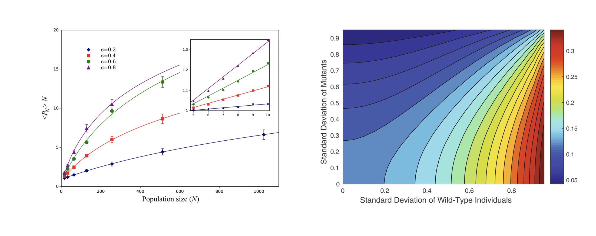

# Effect of random environment on selection pressure of minor populations

_Genotype by random environmental interactions gives an advantage to non-favored minor sub-populations (**Minority Rule**)_

## Introduction

Fixation probability, the probability that the frequency of a newly arising mutation in a population 
will eventually reach unity, is a fundamental quantity in evolutionary genetics. Here we use a number 
of models (several versions of the Moran model and the haploid Wright-Fisher model) to examine fixation 
probabilities for a constant size population where the fitness is a random function of both allelic 
state and spatial position, despite neither allele being favored on average. The concept of fitness 
varying with respect to both genotype and environment is important in models of cancer initiation and progression, 
bacterial dynamics, and drug resistance. 

## Project results

Under our model spatial heterogeneity redefines the notion of neutrality 
for a newly arising mutation, as such mutations fix at a higher rate than that predicted under neutrality. 
The increased fixation probability appears to be due to rare alleles having an advantage. The magnitude of this 
effect can be large, and is an increasing function of the spatial variance and skew in fitness. The effect is 
largest when the fitness values of the mutants and wild types are anti-correlated across environments. We discuss 
results for both a spatial ring geometry of cells (such as that of a colonic crypt), a 2D lattice and a mass-action 
(complete graph) arrangement.

## Achievements
The results of our model have far reaching consequences: 

* The rate of molecular evolution may be higher for genes that are important in GEI, 
* The relationship between patterns of standing variation versus divergence may be more complex than is generally thought, 
and in processes where fixation events are commonly observed (e.g., tumorigenesis) 
* Fixed mutants may not necessarily be _adaptive_, but instead only exhibit environment heterogeneity  
* Our findings have implications for studies of between species DNA divergence and within species standing variation, 
which may not match neutral expectation

## Reference

A. Mahdipour-Shirayeh, A.H. Darooneh, A.D. Long, N.L. Komarova and M. Kohandel, Genotype by random environment 
interactions gives an advantage to non-adaptive neutral minor alleles (2017), Nature Scientific Reports 7(5193)
